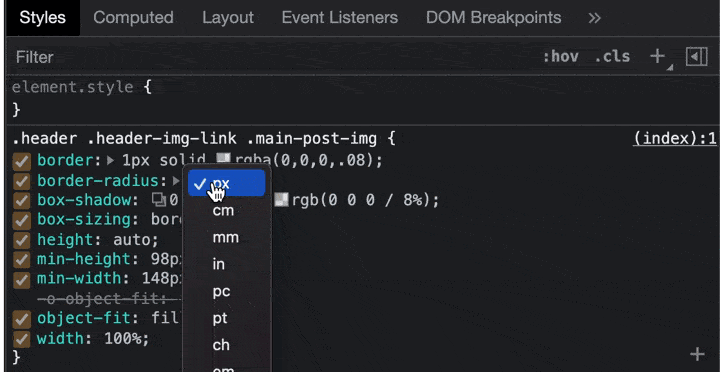
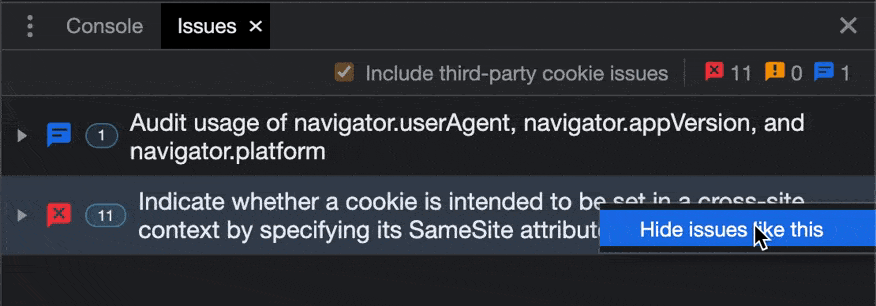

<sub><sup>Photo by [Samantha Gades](https://unsplash.com/@srosinger3997) on Unsplash<sub><sup>

Este post es una traducción revisitada de [What's New In DevTools (Chrome 95)](https://developer.chrome.com/blog/new-in-devtools-95/) de [Jecelyn Yeen](https://developer.chrome.com/authors/jecelynyeen/)

La salida de Chrome 95 esta planeada para el 19 de octubre, aquí algunas de las novedades que han sido implementadas:

_Nuevo instrumento para modificar la propiedad de largo (length)_

En esta nueva version en las propiedades de largo (height, margin), las unidades de medida pueden ser modificadas mediante un selector, que aparecerá después de haber hecho click sobre des eso.

Siempre haciendo referencia al las propiedades de largo ahora con el poner el cursor sobre del numero sera posible cambiar el numero haciendo click y scroll horizontal, manteniendo pulsado a la vez `shift` podemos cambiar el valor de 10.

La posibilidad de cambiar los valores escribiéndolos seguirá disponible.



_Ocultar Errores en la panel de errores_

Con esta version podrás ocultar los errores haciendo click en los tres puntos y clickar en “ocultar errores como este”, así los errores seleccionados se pondrán todos debajo de la misma ventana.



_Mejora en la visualizaciones de las propiedades customizadas_

Ahora las propriedades añadidas por el usuario saldrán en evidencias y ordenadas al principio.

```js
/* example.js */

const link = new URL("https://goo.gle/devtools-blog");

link.user = { id: 1, name: "Jane Doe" };
link.access = "admin";
link.search = `?access=${link.access}`;
```


Lighthouse 8.4 ha sido añadido.
Los snipped en el source panel han sido ordenado alfabeticamente.
Enlace para poder reportar error de tradición en las devTools.
La UI para el devTools ha sido mejorada.
